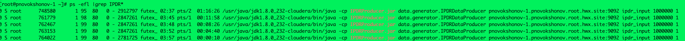
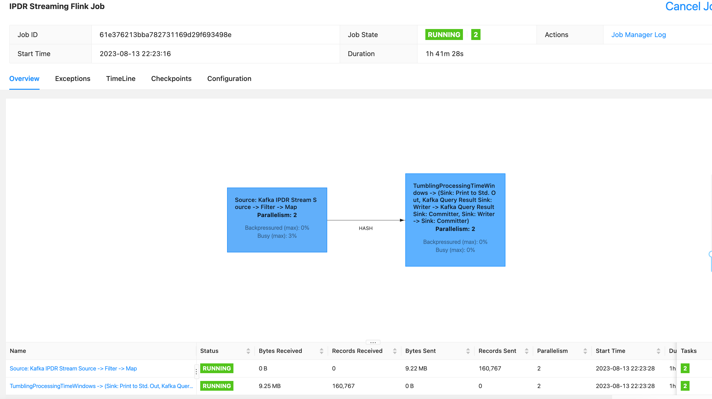

# IPDR Hourly RollUp Example with Flink DataStream API 

## Main logic:
1) Read IPDR messages as an input stream from the Kafka queue, deserialize JSON to POJO
2) Filter the input stream based on dsScn service type as "data"
3) Apply the Map function and build a new output usage message. Convert fromDate field from String to Date and extract Hour
4) Apply the keyBy operator and group by MacAddr and Hour
5) Apply a Tumbling Window function with a certain Window size. Window size is defined in minutes. It could be changed to milliseconds, seconds, hours or days. [More on Flink Window functions:](
   https://nightlies.apache.org/flink/flink-docs-master/docs/dev/datastream/operators/windows/)
6) Apply Aggregator and sum dsOctets to calculate usage
7) Route IPDR output usage messages to the local FileSystem (or HDFS) and a Kafka queue sink.

## Usage on Secured SASL_SSL (Kerberos) Cluster:

To run the command on secured cluster:

```
flink run -yD security.kerberos.login.keytab=<keytab file> -yD security.kerberos.login.principal=<principal_name> -d -p 1 -ys 2 -ynm StreamingIPDRJob target/IPDRStreamingFlink.jar config/job.properties
```

Note: This was tested on CDP Public Cloud Data Hub cluster

## Usage on Unsecured Cluster:

```
flink run -d -p 1 -ys 1 -ytm 1500 -ynm StreamingJob target/IPDRStreamingFlink.jar config/job.properties
```

## Running a Load Test on a 6-node Flink/Kafka cluster

I ran a load test of this code processing data from 50,000 distinct Mac addresses coming over the past 2 hours. With 5 concurrent processes generating
IPDR data, Flink Map task utilization reached only 4%. The main performance limiting factor would be the amount of data generated by IPDR data generator but not the Flink processing capacity.



