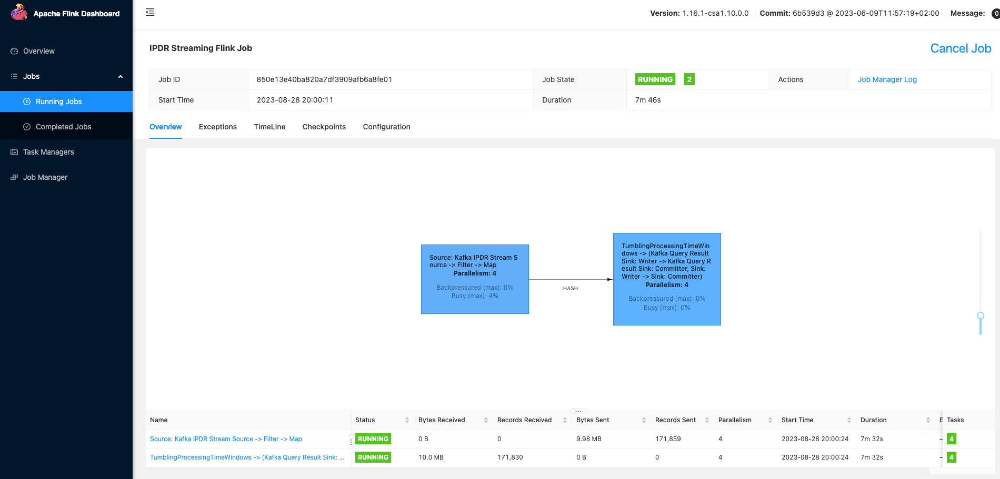
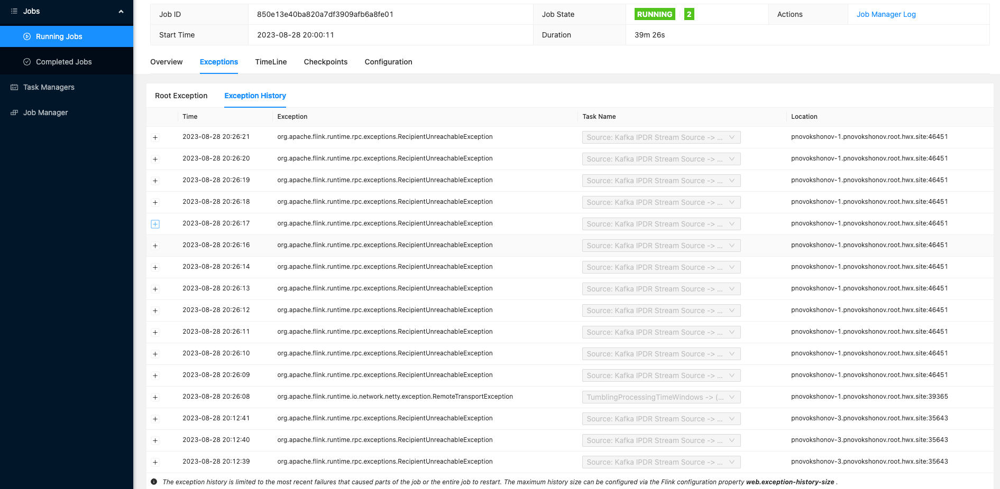
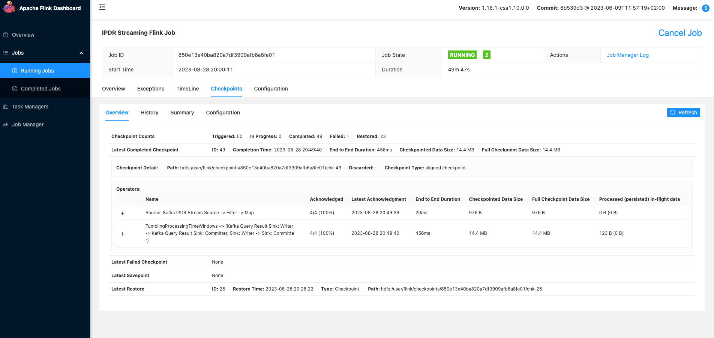
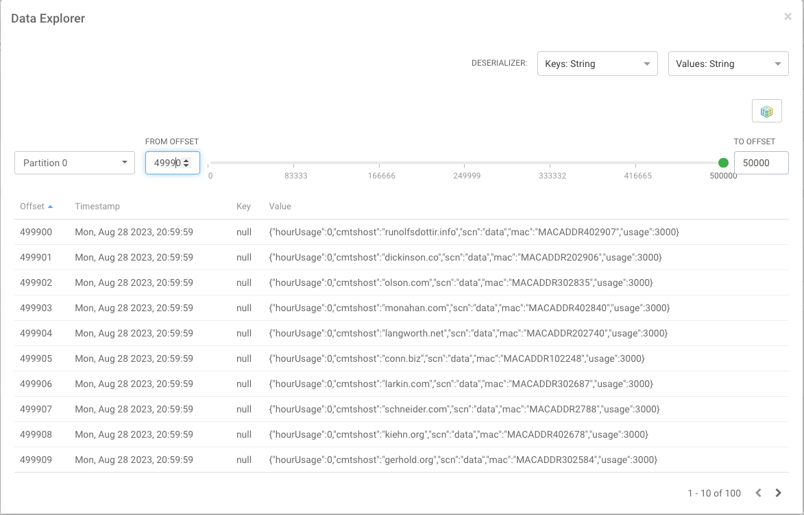
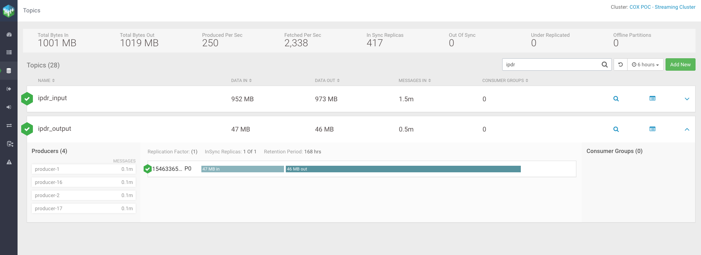
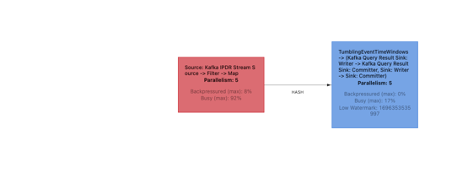
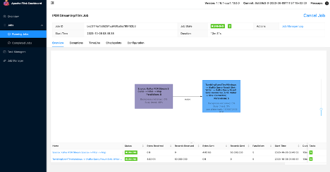

# IPDR Hourly/Daily RollUp Example with Flink DataStream API 

## Main logic
1) Read IPDR messages as an input stream from the Kafka queue, deserialize JSON to POJO
2) Filter the input stream based on dsScn service type as "data"
3) Apply the Map function and build a new output usage message. Convert fromDate field from String to Date and extract Hour
4) Apply the keyBy operator and group by MacAddr and Hour
5) Apply a Tumbling Window function with a certain Window size. Window size is defined in hours. It could be changed to milliseconds, seconds, minutes or days. 
   More info on Flink Window functions is available [here](
   https://nightlies.apache.org/flink/flink-docs-master/docs/dev/datastream/operators/windows/)
6) Apply Aggregator and sum dsOctets to calculate usage for each given MacAddr and Hour.
7) Route IPDR output usage messages to Stdout (optionaly), the local FileSystem (or HDFS) and a Kafka queue sink.

Job configuration parameters are specified in the job.properties file.

## Usage on Secured SASL_SSL (Kerberos) Cluster:

To run the command on secured cluster:

```
flink run -yD security.kerberos.login.keytab=<keytab file> -yD security.kerberos.login.principal=<principal_name> -d -p 1 -ys 2 -ynm StreamingIPDRJob target/IPDRStreamingFlink.jar config/job.properties
```

Note: This was tested on CDP Public Cloud Data Hub cluster. 

## Usage on Unsecured Cluster:

```
flink run -d -p 1 -ys 1 -ytm 1500 -ynm StreamingJob target/IPDRStreamingFlink.jar config/job.properties
```
To fully control the resource utilization of the Flink job, we set the following CLI parameters:

```
-p 8: Parallelism of your pipeline. Controls the number of parallel instances of each operator.
-ys 4: Number of task slots in each TaskManager. It also determines the number of TaskManagers as the result of dividing the parallelism by the number of task slots.
-ytm 1500: TaskManager container memory size that ultimately defines how much memory can be used for heap, network buffers and local state management.
```

## Running a Load Test on a 6-node Flink/Kafka cluster with 500,000 IPDR messages

A load test of this code processed data from 500,000 distinct Mac addresses with the Tumbling Window of 1 hour and a checkpoint interval of 60 seconds. With 5 concurrent processes generating
100,000 IPDR messages, Flink Map task utilization reached only 4%-5%. It took about 15-16 min to push 500,000 IPDR messages through Flink. At total of 1.5M IPDR messages have been aggregated.

```
#Load 500,000 IPDR messages to a topic with 0 sec sleep time
/usr/java/jdk1.8.0_232-cloudera/bin/java -cp IPDRProducer.jar data.generator.IPDRDataProducer pnovokshonov-1.pnovokshonov.root.hwx.site:9092 ipdr_input 100000 0 0   > load1.out 2>&1  &
/usr/java/jdk1.8.0_232-cloudera/bin/java -cp IPDRProducer.jar data.generator.IPDRDataProducer pnovokshonov-1.pnovokshonov.root.hwx.site:9092 ipdr_input 100000 0 100000   > load2.out 2>&1  &
/usr/java/jdk1.8.0_232-cloudera/bin/java -cp IPDRProducer.jar data.generator.IPDRDataProducer pnovokshonov-1.pnovokshonov.root.hwx.site:9092 ipdr_input 100000 0 200000   > load3.out 2>&1  &
/usr/java/jdk1.8.0_232-cloudera/bin/java -cp IPDRProducer.jar data.generator.IPDRDataProducer pnovokshonov-1.pnovokshonov.root.hwx.site:9092 ipdr_input 100000 0 300000   > load4.out 2>&1  &
/usr/java/jdk1.8.0_232-cloudera/bin/java -cp IPDRProducer.jar data.generator.IPDRDataProducer pnovokshonov-1.pnovokshonov.root.hwx.site:9092 ipdr_input 100000 0 400000   > load5.out 2>&1  &
```




## Sample IPDR input Message Format:

```
{"batchId":"103.65.107.58",
"cmIp":{"v4":"198.75.91.98"},
"cmMacAddr":"MACADDR39",
"cmtsHostName":"schaefer.info",
"cmtsIp":{"v4":"103.65.107.58","v6":"cb20:8db0:c3bf:247b:d593:a9f2:1c2f:50af"},
"dsChSet":[31,70,79,26],
"dsIdentifier":5957,
"dsOctets":635159,
"dsPackets":6099,
"dsScn":"default",
"dsTimeActive":35962,
"fromTime":"2023-08-01 19:15:00",
"mdIfIndex":2869,
"mdIfName":"Cable2/1/6",
"qosVersion":3,
"region":"Charlotte",
"timeZone":"EST",
"toTime":"2023-08-01 19:30:00",
"usChSet":[0,6,9,9,8,0,3],
"usIdentifier":89100,
"usOctets":584150,
"usPackets":23106,
"usScn":"default",
"usTimeActive":21239,
"v":2}
```
## Sample IPDR Usage Output Format:

```
{
"hourUsage":14,
"cmtshost":"turner.biz",
"scn":"data",
"mac":"MACADDR37076",
"usage":808697
}
```
## Manually Restarting IPDR Job from checkpoint

Checkpoints make state in Flink fault tolerant by allowing state and the corresponding stream positions to be recovered, thereby giving 
the application the same semantics as a failure-free execution. The primary purpose of checkpoints is to provide a recovery mechanism 
in case of unexpected job failures. A checkpoint’s lifecycle is managed by Flink, i.e. a checkpoint is created, owned, and released 
by Flink - without user interaction. Savepoints are created, owned and deleted solely by the user.

To demo Flink application restart from checkpoint  2 empty Kafka topics: **ipdr_input** and **ipdr_output** were created and  a Flink job
started with the size of a Tumbling Window of 5 minutes and a checkpoint interval of 30 seconds.

```
flink run -d -p 1 -ys 1 -ytm 1500 -ynm StreamingJob target/IPDRStreamingFlink.jar config/job.properties
```

Then IPDR data generator ran 3 times and inserted a total of 30 messages, as shown on the Flink UI below.

```
java -cp IPDRProducer.jar data.generator.IPDRDataProducer pnovokshonov-1.pnovokshonov.root.hwx.site:9092 ipdr_input 10  1000 0
```


Once the next checkpoint occured, the checkpoint path was captured from the Flink UI below. The Flink job was cancelled.


With no Flink job running, IPDR data generator ran 2 more times adding another 20 messages into the **ipdr_input** Kafka topic.

Then a Flink job was restarted from the last checkpoint, as shown in the command below.

```
flink run -d -p 1 -ys 1 -ytm 1500 -ynm StreamingJob -s hdfs:/user/flink/checkpoints/51323f74caa3b2cddf432156188dcb27/chk-4  target/IPDRStreamingFlink.jar config/job.properties
```

Once the Flink job restarted, it was observed in Flink UI that 20 messages have been processed. Those messages came through when Flink application 
was down.


IPDR data generator ran one more time and added 10 more messages in the **ipdr_input** Kafka topic. This was also reflected in the Flink UI.


Once the Tumbling Window expired, a total of 60 IPDR messages have been processed and aggregation results written into  **ipdr_output** topic.


As was demonstrated in this test, Flink recovers from faults by rewinding and replaying the source data streams.

## Automatically Restarting IPDR Job from checkpoint

Similar to the previous test, 2 empty Kafka topics: **ipdr_input** and **ipdr_output** were created and a Flink job started
with the size of a Tumbling Window of 5 minutes and a checkpoint interval of 30 seconds.

Flink Task manager was running on node #5, as shown on the Flink UI below.


IPDR data generator ran and inserted 10 IPDR messages while at the same time Flink's Task Manager processes have been identified and 
killed on node #5 of the cluster.


Flink Web UI briefly highlighted running processors in red and the Task Manager restarted on node #3.


IPDR data generator ran again insterting 10 messages while Flin Task Manager was killed on node #3. This time Task Manager restarted 
on the same node #3.


IPDR data generator ran 2 more times and aggregation results have been written in the target **ipdr_output** topic upon a Tumbling Window
expiration. All 4 IPDR runs aggregated successfully despite several Task Manager restarts.


## Restarting IPDR Job from checkpoint during a Load Test

Restarting Task Manager 2 times during a Load Test with loading 500,000 IPDR messages with distinct mac addresses produced correct aggregation results. Exception
errors caused by Task Manager restarts on nodes #1 and #3 are shown in screenshot below.



Checkpoint stats during a Load Test during a Load Test are shown below.



Input and output Kafka topics stats are presented below. A total of 3 iterations of IPDR loads with 500,000 messages each ran over an hour which resulted
in 1.5M messages in **ipdr_input** and 500K (aggregation) in **ipdr_output**.





## Volume Tests Summary Results with 10M, 20M, 30M, 40M and 50M IPDR messages

Flink command to run IPDR Streaming job with the window size of 1 hour and checkpoint interval 30 sec.
```
flink run -d -p 5 -ys 1 -ytm 3000 -ynm StreamingJob target/IPDRStreamingFlink.jar config/job.properties
```
|IPDR messages in the input topic |Java IPDR Flink |SSB Aggregate job |
|------------------------|----------------|------------------
|10M|2 min |4 min|
|20M|5 min |7 - 9 min |
|30M|6 min |10 - 11 min |
|40M|8-9 min |12 - 13 min |
|50M|12-13 min |13-16 min |

CPU Usage reaches 100% on the source task manager while reading messages from the input topic. Writing results to the ipdr_output table takes less than 1 -2 M.





## Testing with EventTime instead of ProcessingTime

I tested both SSB and Flink aggregation jobs operating on the EventTime instead of Processing time.

With EventTime the tumbling window is closed and the aggregation results are pushed into the sink only when the new chunk of data arrives. 
I used a small window size of 1 min to test against a few hundred IPDR messages.

Test Results:

```
Window start time 1:25

Pushed 100 rows into input Kafka topic
Pushed 100 rows into input Kafka topic
Pushed 100 rows into input Kafka topic

Wall Clock time 1:26

```
Nothing happens in the output topic.  That’s because the watermark has to be pushed further by ingesting a new chunk of data to close the window. 
In SSB job we’re operating on the EventTime which is a timestamp field generated by Kafka for each IPDR message.

```
Pushed 100 rows into input Kafka topic
```
Window closed and Aggregate results for 1:25 – 1:26 appeared in the output topic.

Event time: Event time is the time that each individual event occurred on its producing device. This time is typically embedded within the records 
before they enter Flink, and that event timestamp can be extracted from each record. In event time, the progress of time 
depends on the data, not on any wall clocks. Event time programs must specify how to generate Event Time Watermarks, 
which is the mechanism that signals progress in event time.

The mechanism in Flink to measure progress in event time is watermarks. Watermarks flow as part of the data stream and carry 
a timestamp t. A Watermark(t) declares that event time has reached time t in that stream, meaning that there should be no 
more elements from the stream with a timestamp t’ <= t (i.e. events with timestamps older or equal to the watermark).


